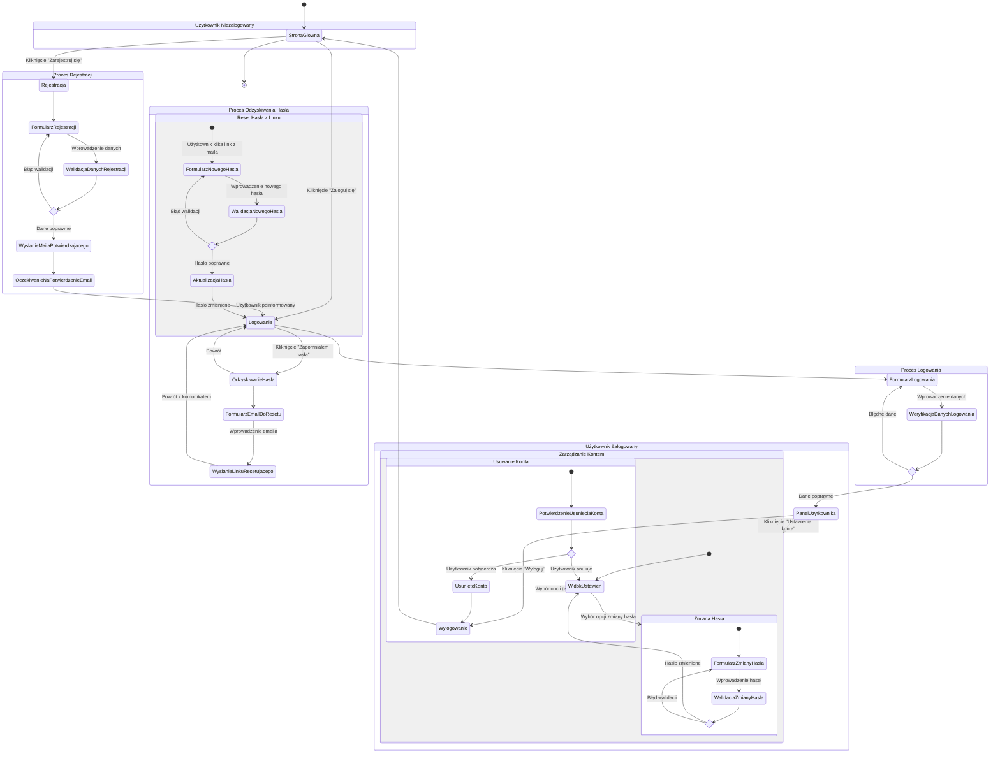

```mermaid
stateDiagram-v2
    [*] --> StronaGlowna

    state "Użytkownik Niezalogowany" as Gosc {
        StronaGlowna --> Logowanie: Kliknięcie "Zaloguj się"
        StronaGlowna --> Rejestracja: Kliknięcie "Zarejestruj się"
        Logowanie --> OdzyskiwanieHasla: Kliknięcie "Zapomniałem hasła"
        OdzyskiwanieHasla --> Logowanie: Powrót
    }

    state "Proces Rejestracji" as ProcesRejestracji {
        Rejestracja --> FormularzRejestracji
        FormularzRejestracji --> WalidacjaDanychRejestracji: Wprowadzenie danych
        state if_walidacja_rejestracji <<choice>>
        WalidacjaDanychRejestracji --> if_walidacja_rejestracji
        if_walidacja_rejestracji --> WyslanieMailaPotwierdzajacego: Dane poprawne
        if_walidacja_rejestracji --> FormularzRejestracji: Błąd walidacji
        WyslanieMailaPotwierdzajacego --> OczekiwanieNaPotwierdzenieEmail
        OczekiwanieNaPotwierdzenieEmail --> Logowanie: Użytkownik poinformowany
    }

    state "Proces Logowania" as ProcesLogowania {
        Logowanie --> FormularzLogowania
        FormularzLogowania --> WeryfikacjaDanychLogowania: Wprowadzenie danych
        state if_weryfikacja_logowania <<choice>>
        WeryfikacjaDanychLogowania --> if_weryfikacja_logowania
        if_weryfikacja_logowania --> PanelUzytkownika: Dane poprawne
        if_weryfikacja_logowania --> FormularzLogowania: Błędne dane
    }

    state "Proces Odzyskiwania Hasła" as ProcesOdzyskiwaniaHasla {
        OdzyskiwanieHasla --> FormularzEmailDoResetu
        FormularzEmailDoResetu --> WyslanieLinkuResetujacego: Wprowadzenie emaila
        WyslanieLinkuResetujacego --> Logowanie: Powrót z komunikatem
        
        state "Reset Hasła z Linku" as ResetZLinku {
            [*] --> FormularzNowegoHasla: Użytkownik klika link z maila
            FormularzNowegoHasla --> WalidacjaNowegoHasla: Wprowadzenie nowego hasła
            state if_walidacja_nowego_hasla <<choice>>
            WalidacjaNowegoHasla --> if_walidacja_nowego_hasla
            if_walidacja_nowego_hasla --> AktualizacjaHasla: Hasło poprawne
            if_walidacja_nowego_hasla --> FormularzNowegoHasla: Błąd walidacji
            AktualizacjaHasla --> Logowanie: Hasło zmienione
        }
    }

    state "Użytkownik Zalogowany" as Zalogowany {
        PanelUzytkownika --> Wylogowanie: Kliknięcie "Wyloguj"
        PanelUzytkownika --> UstawieniaKonta: Kliknięcie "Ustawienia konta"
        
        state "Zarządzanie Kontem" as UstawieniaKonta {
            [*] --> WidokUstawien
            WidokUstawien --> ZmianaHasla: Wybór opcji zmiany hasła
            WidokUstawien --> UsuniecieKonta: Wybór opcji usunięcia konta

            state "Zmiana Hasła" as ZmianaHasla {
                [*] --> FormularzZmianyHasla
                FormularzZmianyHasla --> WalidacjaZmianyHasla: Wprowadzenie haseł
                state if_walidacja_zmiany <<choice>>
                WalidacjaZmianyHasla --> if_walidacja_zmiany
                if_walidacja_zmiany --> WidokUstawien: Hasło zmienione
                if_walidacja_zmiany --> FormularzZmianyHasla: Błąd walidacji
            }

            state "Usuwanie Konta" as UsuniecieKonta {
                [*] --> PotwierdzenieUsunieciaKonta
                state if_potwierdzenie_usuniecia <<choice>>
                PotwierdzenieUsunieciaKonta --> if_potwierdzenie_usuniecia
                if_potwierdzenie_usuniecia --> UsunietoKonto: Użytkownik potwierdza
                if_potwierdzenie_usuniecia --> WidokUstawien: Użytkownik anuluje
                UsunietoKonto --> Wylogowanie
            }
        }
    }
    
    Wylogowanie --> StronaGlowna
    StronaGlowna --> [*]
```

