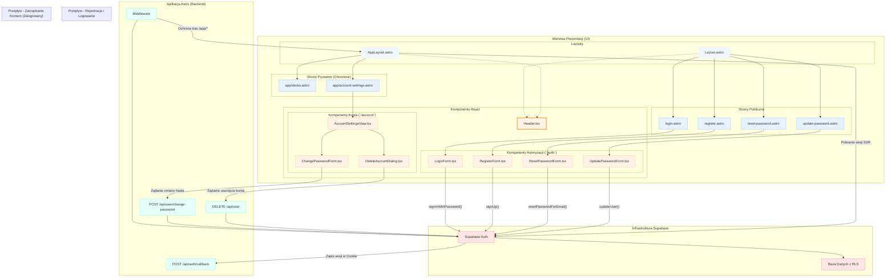

```mermaid
flowchart TD
    classDef page fill:#e6f2ff,stroke:#b3d9ff,stroke-width:2px;
    classDef layout fill:#f0f8ff,stroke:#d6eaff,stroke-width:1px,stroke-dasharray: 5 5;
    classDef component fill:#fff2e6,stroke:#ffdab3,stroke-width:2px;
    classDef api fill:#e6fffa,stroke:#b3ffe6,stroke-width:2px;
    classDef supabase fill:#ffe6e6,stroke:#ffb3b3,stroke-width:2px;
    classDef updatedComponent fill:#fff2e6,stroke:#ff9933,stroke-width:3px;

    subgraph "Infrastruktura Supabase"
        SUPABASE_AUTH[Supabase Auth]:::supabase
        SUPABASE_DB[Baza Danych z RLS]:::supabase
        SUPABASE_AUTH --> SUPABASE_DB
    end

    subgraph "Aplikacja Astro (Backend)"
        MIDDLEWARE[Middleware]:::api
        API_CHANGE_PASSWORD["POST /api/user/change-password"]:::api
        API_DELETE_USER["DELETE /api/user"]:::api
        API_CALLBACK["POST /api/auth/callback"]:::api

        MIDDLEWARE --> SUPABASE_AUTH
        API_CHANGE_PASSWORD --> SUPABASE_AUTH
        API_DELETE_USER --> SUPABASE_AUTH
    end
    
    subgraph "Warstwa Prezentacji (UI)"
        subgraph "Strony Publiczne"
            direction LR
            PAGE_LOGIN[login.astro]:::page
            PAGE_REGISTER[register.astro]:::page
            PAGE_RESET[reset-password.astro]:::page
            PAGE_UPDATE[update-password.astro]:::page
        end

        subgraph "Strony Prywatne (Chronione)"
            direction LR
            PAGE_DECKS[app/decks.astro]:::page
            PAGE_ACCOUNT[app/account-settings.astro]:::page
        end
        
        subgraph "Layouty"
            LAYOUT_PUBLIC[Layout.astro]:::layout
            LAYOUT_APP[AppLayout.astro]:::layout
        end

        subgraph "Komponenty React"
            C_HEADER[Header.tsx]:::updatedComponent
            
            subgraph "Komponenty Autoryzacji (`/auth`)"
                C_LOGIN[LoginForm.tsx]:::component
                C_REGISTER[RegisterForm.tsx]:::component
                C_RESET[ResetPasswordForm.tsx]:::component
                C_UPDATE[UpdatePasswordForm.tsx]:::component
            end
            
            subgraph "Komponenty Konta (`/account`)"
                C_ACCOUNT_VIEW[AccountSettingsView.tsx]:::component
                C_CHANGE_PASSWORD[ChangePasswordForm.tsx]:::component
                C_DELETE_DIALOG[DeleteAccountDialog.tsx]:::component
            end
        end
    end
    
    %% Powiązania Layoutów ze Stronami
    LAYOUT_PUBLIC --> PAGE_LOGIN
    LAYOUT_PUBLIC --> PAGE_REGISTER
    LAYOUT_PUBLIC --> PAGE_RESET
    LAYOUT_PUBLIC --> PAGE_UPDATE
    
    LAYOUT_APP --> PAGE_DECKS
    LAYOUT_APP --> PAGE_ACCOUNT

    %% Powiązania Stron z Komponentami
    PAGE_LOGIN --> C_LOGIN
    PAGE_REGISTER --> C_REGISTER
    PAGE_RESET --> C_RESET
    PAGE_UPDATE --> C_UPDATE
    PAGE_ACCOUNT --> C_ACCOUNT_VIEW
    
    LAYOUT_PUBLIC -.-> C_HEADER
    LAYOUT_APP -.-> C_HEADER
    
    C_ACCOUNT_VIEW --> C_CHANGE_PASSWORD
    C_ACCOUNT_VIEW --> C_DELETE_DIALOG
    
    %% Przepływ Danych i Interakcje
    
    subgraph "Przepływ - Rejestracja i Logowanie"
        C_LOGIN -- "signInWithPassword()" --> SUPABASE_AUTH
        C_REGISTER -- "signUp()" --> SUPABASE_AUTH
        C_RESET -- "resetPasswordForEmail()" --> SUPABASE_AUTH
        C_UPDATE -- "updateUser()" --> SUPABASE_AUTH
    end

    subgraph "Przepływ - Zarządzanie Kontem (Zalogowany)"
        C_CHANGE_PASSWORD -- "Żądanie zmiany hasła" --> API_CHANGE_PASSWORD
        C_DELETE_DIALOG -- "Żądanie usunięcia konta" --> API_DELETE_USER
    end
    
    SUPABASE_AUTH -- "Zapis sesji w Cookie" --> API_CALLBACK
    
    MIDDLEWARE -- "Ochrona tras /app/*" --> LAYOUT_APP
    LAYOUT_APP -- "Pobranie sesji SSR" --> SUPABASE_AUTH
```